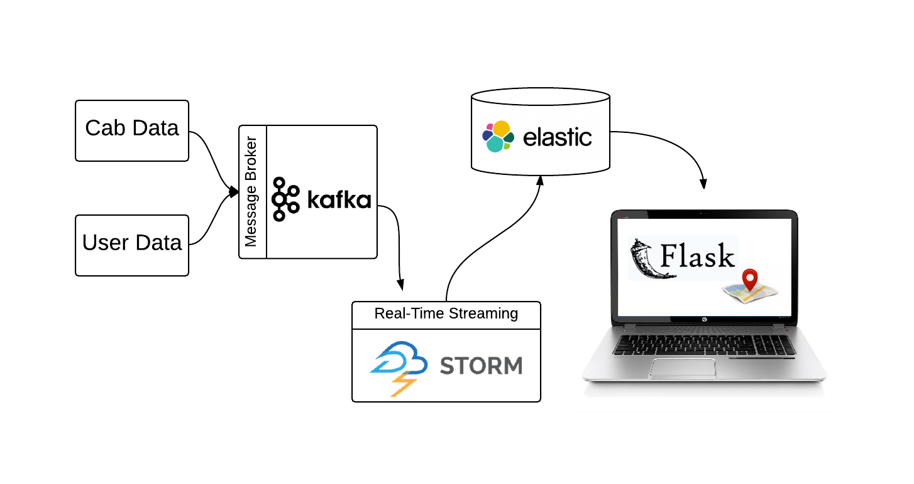

RideOn
=================

[RideOn](http://mydiemho.link) was my big data project as part of [Insight Data Science's](http://insightdataengineering.com/) Engineering fellowship program from June 2015 through July 2015

## Intro
**RideOn** is an open-source data pipeline to simulate realtime ridesharing. It includes a map that let user search for nearby cars and visualizations that monitor the pipeline.

It makes use of the following technologies:

- Apache Zookeeper 3.4.6
- Apache Kafka 0.8.2.1
- Apache Storm 0.9.2
- Elasticsearch 1.6.0
- Flask with the following frameworks: [Google Maps](https://developers.google.com/maps/documentation/javascript/), jQuery, [Bootstrap](http://getbootstrap.com/)
- [Kafka-Python](https://github.com/mumrah/kafka-python) 0.9.2 (Kafka with Python)
- [pyleus](https://github.com/Yelp/pyleus 0.2.4) (Storm with Python)
- [pyelasticsearch](https://github.com/pyelasticsearch/pyelasticsearch) 1.3 (Elasticsearch with Python)
- [storm-graphite](https://github.com/verisign/storm-graphite) 0.1.4
- [statsd](https://github.com/etsy/statsd) 0.7.2
- [kafka-statsd-metrics2](https://github.com/airbnb/kafka-statsd-metrics2) 0.4.0
- [kafka-manager](https://github.com/yahoo/kafka-manager) 1.2.4

## Live Demo
A [live demo](http://mydiemho.link) is currently (June 2015) running.

Read further for more details about the project

## The Data

To simulate car movement, I used a dataset of mobility traces of taxi cabs in San Francisco, USA provided by [CRAWDAD](http://crawdad.org/epfl/mobility/).

To simulate user request, I used businesses in San Francisco as check points.

## Pipeline Overview

## Realtime Processing

I used **Apache Storm** to provide real-time data processing.

- A 4-node cluster with 3 supervisors.
- 2 topologies: one to process location updates and one to process user request.
- Each topology consists of a kafka-spout and a bolt
- The Storm topology is loaded via **Pyleus**.

## Realtime Kafka and Storm monitoring

## Install And Setup:

Instructions are specific to Debian/Ubuntu.

### Elasticsearch

#### The following [instruction](https://www.elastic.co/guide/en/elasticsearch/reference/current/setup-repositories.html) is for installing and running elasticsearch as a service

	wget -qO - https://packages.elastic.co/GPG-KEY-elasticsearch | sudo apt-key add -
	echo "deb http://packages.elastic.co/elasticsearch/1.6/debian stable main" | sudo tee -a /etc/apt/sources.list
	sudo apt-get update && sudo apt-get install elasticsearch
	
	#if you're using AWS instaces, the following plugin will allows the nodes in the cluster to discover each other.
	sudo /usr/share/elasticsearch/bin/plugin install elasticsearch/elasticsearch-cloud-aws/2.5.0

##### Here are a few useful [directories](https://www.elastic.co/guide/en/elasticsearch/reference/current/setup-dir-layout.html)

###### Plugins
/usr/share/elasticsearch/bin/plugin

###### Logs
/var/log/elasticsearch/

###### Config
/etc/elasticsearch/

#### Recommended configurations change

###### [Heap size](https://www.elastic.co/guide/en/elasticsearch/guide/current/heap-sizing.html#_give_half_your_memory_to_lucene)

Elasticsearch is preconfigured with a 1GB heap, which is too small for most setup.  The recommended value is **half** of your instance's memory, ie. 4g if you have 8b of memory.  Uncomment the following line in **/etc/default/elasticsearch** and replace the default with your desired value.

	sudo vi /etc/default/elasticsearch
	
	# uncomment this line and replace with your desired value
	ES_HEAP_SIZE=1g
	
###### [Increase the number of file descriptors](https://www.elastic.co/guide/en/elasticsearch/guide/current/_file_descriptors_and_mmap.html)

Ubunut instances have a default value of 1024, which is not enought for Elasticsearch.  The recommendation is at least **64000**. Add the following lines to **/etc/security/limit.conf**
	
	sudo vi /etc/security/limits.conf
	
	# add the following lines 
	* soft nofile 64000
	* hard nofile 64000

#### Now you can start your service
	sudo /etc/init.d/elasticsearch start
	
### ZOOKEEPER
Coming soon.

### KAFKA
Coming soon.

### STORM
Coming soon.

#### Topologies logging
The topologies send their logs to the **pyleus** directory in **/tmp** so please make sure it exists on all supervisor nodes.  You'll also need to do this in the nimbus node if you wish to run the topology locally.

	cd /tmp
	mkdir pyleus

### Storm-Graphite
Coming soon.

### Graphite
Coming soon.

### Grafana
Coming soon.

### Statsd
Coming soon.

### Configuration files
Please see [configurations](notes/configurations) for the settings I use for my set up.
 
## Supervisord

> It's critical that you run Zookeeper under supervision, since Zookeeper is fail-fast and will exit the process if it encounters any error case.

> ...
 
> It is critical that you run each of these daemons under supervision. Storm is a fail-fast system which means the processes will halt whenever an unexpected error is encountered. Storm is designed so that it can safely halt at any point and recover correctly when the process is restarted. This is why Storm keeps no state in-process – if Nimbus or the Supervisors restart, the running topologies are unaffected.
> 
> -- [Storm documentation](https://storm.apache.org/documentation/Setting-up-a-Storm-cluster.html)

### Storm
#### Master node: Nimbus and UI daemons
Add the following lines to **/etc/supervisord.conf/storm.conf** on the nimbus node:

	[program:storm-nimbus]
	command=/usr/local/storm/bin/storm nimbus
	user=ubuntu
	autostart=true
	autorestart=true
	startsecs=10
	startretries=999
	log_stdout=true
	log_stderr=true
	logfile=/usr/local/storm/logs/nimbus.out
	logfile_maxbytes=20MB
	logfile_backups=10

	[program:storm-ui]
	command=/usr/local/storm/bin/storm ui
	user=ubuntu
	autostart=true
	autorestart=true
	startsecs=10
	startretries=999
	log_stdout=true
	log_stderr=true
	logfile=/usr/local/storm/logs/ui.out
	logfile_maxbytes=20MB
	logfile_backups=10

#### Superivsor nodes: supervisor daemons
Add the following lines to **/etc/supervisord.conf/storm.conf** on all the superviosr nodes:

	[program:storm-supervisor]
	command=/usr/local/storm/bin/storm supervisor
	user=ubuntu
	autostart=true
	autorestart=true
	startsecs=10
	startretries=999
	log_stdout=true
	log_stderr=true
	logfile=/usr/local/storm/logs/supervisor.out
	logfile_maxbytes=20MB
	logfile_backups=10

### Kafka

Add the following lines to **/etc/supervisord.conf/kafka.conf** on all the kafka nodes:

	[program:kafka]
	command=pidproxy /var/run/kafka.pid /usr/local/kafka/bin/kafka-server-start.sh /usr/local/kafka/config/server.properties
	user=ubuntu
	autostart=false
	autorestart=true
	startsecs=10
	startretries=999
	log_stdout=true
	log_stderr=true
	logfile=/usr/local/kafka/logs/supervisord-kafka.out
	logfile_maxbytes=20MB
	logfile_backups=10
	stopasgroup=true

* If you want to enable JMX port, add the following line to **kafka-server-start.sh**

		export JMX_PORT=${JMX_PORT:-9999}
	
* Kafka are not set to autorun on first start up because we want zookeeper to be up and running firt.  Start kafka manually after checking that zookeeper is up and running.  You only have to do this once when you first set up the cluster or when the instance reboot.
		
		# verify that zookeeper is up
		sudo supervisorctl status
	
		# start kafka manually
		sudo supervisorctl start kafka
	
### Zookeeper

Add the following lines to **/etc/supervisord.conf/zookeeper.conf** on all the zookeeper nodes:

	[program:zookeeper]
	command=/usr/local/zookeeper/bin/zkServer.sh start-foreground
	autostart=true
	autorestart=true
	stopsignal=KILL
	user=ubuntu
	stderr_logfile=/usr/local/zookeeper/logs/zk.err.log
	stdout_logfile=/usr/local/zookeeper/logs/zk.out.log

### Usage

Run the following command on each node.  

	sudo service supervisord start
	
	# To verify whether daemons started successfully
	sudo supervisorctl status

#### GOTCHAS
Make sure to give whatever user (if not root) you specified in the config file permission to Kafka, Zookeeper and Storm home directories.

	sudo chown ubuntu -R [$KAFKA_HOME/$ZOOKEEPER_HOME/$STORM_HOME]
	
## USAGE
Assuming that you have a storm, kafka and zookeeper cluster up and running:

1. Replace values in [config/config.json] with appropriate values: kafka_cluster, es_cluster, etc.
2. Create the index in ElasticSearch.  I recommend running this on an Elastsearch node.

		cd <PATH_TO_DIRECTORY>/elasticsearch/
		./createIndex.sh
	
3. Submit topologies.  Run the following in your nimbus node.
	
		cd <PATH_TO_DIRECTORY>/storm
		./build geo_update_topology.yaml
		./build request_processing_topology.yaml
		
		./submit geo_update_topology.jar
		./submit request_processing_topology.jar
		
4. To start simulations.  I recommend running this outside of your storm or Elasticsearch clusters.
	
		cd <PATH_TO_DIRECTORY>/simulations
		./run.sh
		
		# to check that everything is running.  You should see 3 detached screens
		screen -ls

4. To stop simulation (on the same instance that you started the simulation).  **WARNING** this will kill all detached screens

		cd <PATH_TO_DIRECTORY>/simulations
		./stop.sh
		
		# to check that everything is stop. 
		screen -ls

## Presentation Deck
My presentation slides are available at [slideshare](http://www.slideshare.net/MsSophieHowl/my-ho-week5demo).

