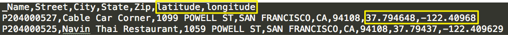

RideOn
=================

[RideOn](http://mydiemho.link) was my big data project as part of [Insight Data Science's](http://insightdataengineering.com/) Engineering fellowship program from June 2015 through July 2015

## Intro
**RideOn** is an open-source data pipeline to simulate realtime ridesharing. It includes a map that let user search for nearby cars and visualizations that monitor the pipeline.

It makes use of the following technologies:
- Apache Zookeeper 3.4.6
- Apache Kafka 0.8.2.1
- Apache Storm 0.9.2
- Elasticsearch 1.6.0
- Flask with the following frameworks: Google Map, jQuery, Bootstrap
- Kafka-Python 0.9.2 (Kafka with Python)
- Pyleus 0.2.4 (Storm with Python)
- pyelasticsearch 1.3 (Elasticsearch with Python)
- [storm-graphite](https://github.com/verisign/storm-graphite) 0.1.4
- [statsd](https://github.com/etsy/statsd) 0.7.2
- [kafka-statsd-metrics2](https://github.com/airbnb/kafka-statsd-metrics2) 0.4.0

## Live Demo
A [live demo](http://mydiemho.link) is currently (June 2015) running.

Read further for more details about the project

## The Data

To simulate car movement, I used a dataset of mobility traces of taxi cabs in San Francisco, USA provided by [CRAWDAD](http://crawdad.org/epfl/mobility/).

To simulate user request, I used locations of businesses in San Francisco as check points.

## Pipeline Overview

## Realtime Processing

I used **Apache Storm** to provide real-time data processing.

- A 4-node cluster with 3 supervisors.
- 2 topologies: one to process location updates and one to process user request.
- Each topology consists of a kafka-spout and a bolt
- The Storm topology is loaded via **Pyleus**.

## Realtime Kafka and Storm monitoring

## Install And Setup:

Instructions are specific to Debian/Ubuntu.

### Elasticsearch

#### The following instruction is for installing and running elasticsearch as a service

	wget -qO - https://packages.elastic.co/GPG-KEY-elasticsearch | sudo apt-key add -
	echo "deb http://packages.elastic.co/elasticsearch/1.6/debian stable main" | sudo tee -a /etc/apt/sources.list
	sudo apt-get update && sudo apt-get install elasticsearch
	
	#if you're using AWS instaces, the following plugin will allows the nodes in the cluster to discover each other.
	sudo /usr/share/elasticsearch/bin/plugin install elasticsearch/elasticsearch-cloud-aws/2.5.0

##### Here are a few useful directories

###### Plugins
/usr/share/elasticsearch/bin/plugin

###### Logs
/var/log/elasticsearch/

###### Config
/etc/elasticsearch/

#### Recommended configurations change

###### [Set heap size](https://www.elastic.co/guide/en/elasticsearch/guide/current/heap-sizing.html#_give_half_your_memory_to_lucene)

Elasticsearch is preconfigured with a 1GB heap, which is too small for most setup.  The recommended value is **half** of your instance's memory, ie. 4g if you have 8b of memory.  Uncomment the following line in **/etc/default/elasticsearch** and replace the default with your desired value.

	sudo vi /etc/default/elasticsearch
	
	# uncomment this line and replace with your desired value
	ES_HEAP_SIZE=1g
	
###### [Increase the number of file descriptors](https://www.elastic.co/guide/en/elasticsearch/guide/current/_file_descriptors_and_mmap.html)

Ubunut instances have a default value of 1024, which is not enought for Elasticsearch.  The recommendation is at least **64000**. Add the following lines to **/etc/security/limit.conf**
	
	sudo vi /etc/security/limits.conf
	
	# add the following lines 
	* soft nofile 64000
	* hard nofile 64000

#### Now you can start your service
	sudo /etc/init.d/elasticsearch start
	
## Supervisord

> It's critical that you run Zookeeper under supervision, since Zookeeper is fail-fast and will exit the process if it encounters any error case.

> ...
 
> It is critical that you run each of these daemons under supervision. Storm is a fail-fast system which means the processes will halt whenever an unexpected error is encountered. Storm is designed so that it can safely halt at any point and recover correctly when the process is restarted. This is why Storm keeps no state in-process – if Nimbus or the Supervisors restart, the running topologies are unaffected.
> 
> [Storm documentation](https://storm.apache.org/documentation/Setting-up-a-Storm-cluster.html)

Please see [instructions](notes/supervisordConfig.txt) for setting up supervisord for Kafka, Zookeeper and Storm

### GOTCHAS
Make sure to give whatever user (if not root) you specified in the config file permission to Kafka, Zookeeper and Storm home directories.

	sudo chown ubuntu -R [$KAFKA_HOME/$ZOOKEEPER_HOME/$STORM_HOME]

## Presentation Deck
My presentation slides are available at [slideshare](http://www.slideshare.net/MsSophieHowl/my-ho-week5demo).

